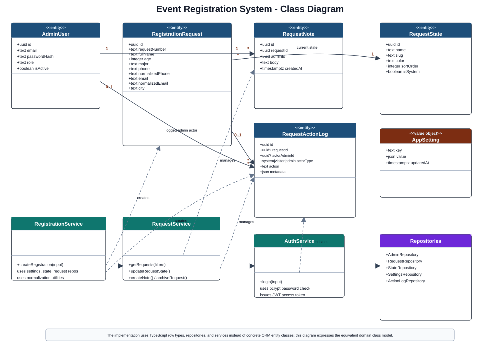
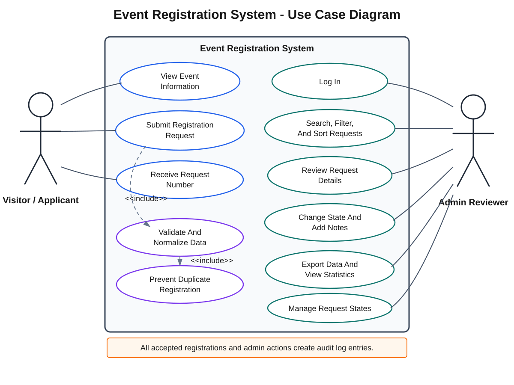
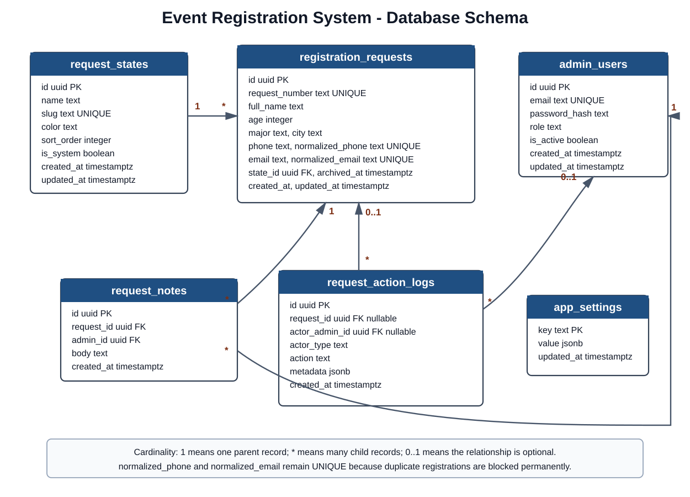

# Event Registration System Project Book

Public Registration, Admin Review Workflow, Request States, And Audit-Ready Operations

PlanningSoftwares

Prepared By

Mohamed Abdulrahman Muftah Al-Kadiki - 6128  
Abdulrahman Ibrahim Fathi Al-Dalh - 6146  
Jamaleddin Burhaneddin Zahri Muntasser - 6170

## Table Of Contents

1. [Chapter 1: Introduction And System Overview](#chapter-1-introduction-and-system-overview)
2. [Chapter 2: System Analysis And Design](#chapter-2-system-analysis-and-design)
3. [Chapter 3: Implementation Using Node.js, Express, And React](#chapter-3-implementation-using-nodejs-express-and-react)
4. [Chapter 4: Testing And Results](#chapter-4-testing-and-results)
5. [Chapter 5: Evaluation And Future Improvements](#chapter-5-evaluation-and-future-improvements)

## Chapter 1: Introduction And System Overview

### 1.1 Project Title

The project title is **Event Registration System**. The system is designed for a company that organizes an event and needs a controlled way to receive, review, categorize, and manage visitor registration requests.

### 1.2 Problem Description

Event registration is often handled through simple forms or manual lists. This approach creates several problems:

- Duplicate registrations may be submitted using the same phone number or email.
- Visitor data may be incomplete or invalid.
- Admins may not have a clear workflow for reviewing requests.
- Requests may be difficult to filter by major, city, state, or date.
- There may be no audit record showing who changed a request and when.
- Statistics and exports may require manual work.

The main problem is not only collecting registrations. The real problem is managing registration requests in a professional review workflow where every request has a clear state, valid contact information, and traceable administrative actions.

### 1.3 Project Objectives

The system aims to:

- Display event registration capabilities professionally.
- Receive registration requests from visitors.
- Validate visitor data before saving it.
- Prevent duplicate registrations by phone number and email.
- Store every accepted request under an initial review state.
- Allow admins to search, filter, sort, and review requests.
- Allow admins to change request states and add internal notes.
- Provide statistics that summarize the registration process.
- Export request data when needed.
- Record important actions in an audit log.

### 1.4 System Overview

The Event Registration System consists of a public registration workflow and an administrative review workflow.

Visitors submit a form containing their full name, age, major, phone number, email, and city. The backend validates this data, normalizes phone and email values, checks for duplicates, and saves valid requests under the `under_review` state.

Admins log in to a protected control panel. They can view the request table, filter by major, state, city, or registration date, search by name, phone, or email, review request details, change the request state, add notes, archive records, view statistics, and export data.

### 1.5 Target Users

| User | Description | Main Actions |
| --- | --- | --- |
| Visitor / Applicant | A person interested in registering for the event. | Submit registration information and receive a request number. |
| Admin Reviewer | A staff member responsible for reviewing requests. | Log in, review requests, change states, add notes, export data, and view statistics. |

## Chapter 2: System Analysis And Design

### 2.1 Functional Requirements

Functional requirements describe what the system must do.

| ID | Requirement |
| --- | --- |
| FR-01 | The system shall allow visitors to submit a registration request. |
| FR-02 | The system shall validate full name, age, major, phone number, email, and city. |
| FR-03 | The system shall normalize email and phone data before duplicate checks. |
| FR-04 | The system shall reject duplicate registrations by normalized phone or normalized email. |
| FR-05 | The system shall create a unique request number for every accepted registration. |
| FR-06 | The system shall save new requests under the `under_review` state. |
| FR-07 | The system shall allow admins to log in securely. |
| FR-08 | The system shall allow admins to list, search, filter, sort, and paginate requests. |
| FR-09 | The system shall allow admins to view request details. |
| FR-10 | The system shall allow admins to change request state. |
| FR-11 | The system shall allow admins to add internal notes. |
| FR-12 | The system shall allow admins to archive and unarchive requests. |
| FR-13 | The system shall allow admins to manage request states. |
| FR-14 | The system shall prevent deleting linked states unless records are transferred. |
| FR-15 | The system shall provide statistics by state, major, and city. |
| FR-16 | The system shall export filtered request data as CSV. |
| FR-17 | The system shall record important actions in an audit log. |

### 2.2 Non-Functional Requirements

| Category | Requirement |
| --- | --- |
| Security | Admin endpoints must be protected by authentication. Passwords must be hashed. |
| Reliability | Accepted registrations must be stored consistently in PostgreSQL. |
| Maintainability | The backend should be organized using MVC-style separation. |
| Validation | Invalid inputs must return clear structured errors. |
| Auditability | Important actions must be stored in action logs. |
| Performance | Request lists must support pagination and indexed filters. |
| Extensibility | Request states must be configurable without changing code. |
| Data Quality | Phone and email values must be normalized for duplicate prevention. |

### 2.3 Use Case Scenarios

| Actor | Use Case | Scenario |
| --- | --- | --- |
| Visitor | Submit registration request | Visitor opens the registration page, enters valid data, submits the form, and receives a request number. |
| Visitor | Submit invalid data | Visitor submits missing or invalid values and receives field-level validation errors. |
| Visitor | Submit duplicate data | Visitor uses an existing phone or email and receives a duplicate registration error. |
| Admin Reviewer | Review requests | Admin logs in, opens the request table, filters records, and opens a request detail page. |
| Admin Reviewer | Change request state | Admin reviews a request and moves it from `under_review` to another state. |
| Admin Reviewer | Add internal note | Admin records private review comments for future reference. |
| Admin Reviewer | Export data | Admin exports filtered requests as a CSV file. |
| Admin Reviewer | Manage states | Admin adds, edits, recolors, reorders, or deletes states according to system rules. |

### 2.4 Class Diagram

The class diagram summarizes the main domain classes concluded from the project implementation and database schema. The backend uses TypeScript row types, repositories, and services rather than ORM entity classes, so the diagram represents the domain model and its service boundaries.



### 2.5 Use Case Diagram

The use case diagram shows the main interactions between the visitor, admin reviewer, and the system.



### 2.6 System Architecture

The backend is designed as a Node.js application using Express. PostgreSQL stores the data. The frontend can be a public registration page and an admin control panel that both communicate with the backend API.

```text
Visitor Browser
  -> Public Registration Page
  -> Express API
  -> PostgreSQL Database

Admin Browser
  -> Admin Control Panel
  -> Protected Express API
  -> PostgreSQL Database
```

### 2.7 Database Design

The database is designed around registration requests, request states, admin users, notes, action logs, and settings.



### 2.8 Database Tables

| Table | Purpose |
| --- | --- |
| `admin_users` | Stores admin accounts, password hashes, roles, and status. |
| `request_states` | Stores configurable review states such as under review, approved, and no reply. |
| `registration_requests` | Stores visitor registration data and current state. |
| `request_notes` | Stores internal admin notes attached to requests. |
| `request_action_logs` | Stores audit records for system and admin actions. |
| `app_settings` | Stores configurable values such as age limits and default state. |

### 2.9 Table Schemas

#### 2.9.1 `admin_users`

| Column | Type | Description |
| --- | --- | --- |
| `id` | `uuid` | Primary key. |
| `email` | `text` | Unique admin email. |
| `password_hash` | `text` | Hashed password, not the plain password. |
| `role` | `text` | Initial value is `admin`. |
| `is_active` | `boolean` | Controls whether the account can log in. |
| `created_at` | `timestamptz` | Creation time. |
| `updated_at` | `timestamptz` | Last update time. |

#### 2.9.2 `request_states`

| Column | Type | Description |
| --- | --- | --- |
| `id` | `uuid` | Primary key. |
| `name` | `text` | Display name. |
| `slug` | `text` | Unique stable state identifier. |
| `color` | `text` | Color used by the admin interface. |
| `sort_order` | `integer` | Display order. |
| `is_system` | `boolean` | Marks default states that cannot be deleted. |
| `created_at` | `timestamptz` | Creation time. |
| `updated_at` | `timestamptz` | Last update time. |

#### 2.9.3 `registration_requests`

| Column | Type | Description |
| --- | --- | --- |
| `id` | `uuid` | Primary key. |
| `request_number` | `text` | Human-readable unique request number. |
| `full_name` | `text` | Applicant full name. |
| `age` | `integer` | Applicant age. |
| `major` | `text` | Applicant major. |
| `phone` | `text` | Original submitted phone value. |
| `normalized_phone` | `text` | E.164 phone value used for duplicate checks. |
| `email` | `text` | Submitted email. |
| `normalized_email` | `text` | Lowercase email used for duplicate checks. |
| `city` | `text` | Applicant city. |
| `state_id` | `uuid` | Foreign key to `request_states`. |
| `archived_at` | `timestamptz` | Archive time, nullable. |
| `created_at` | `timestamptz` | Registration time. |
| `updated_at` | `timestamptz` | Last update time. |

#### 2.9.4 `request_notes`

| Column | Type | Description |
| --- | --- | --- |
| `id` | `uuid` | Primary key. |
| `request_id` | `uuid` | Foreign key to `registration_requests`. |
| `admin_id` | `uuid` | Foreign key to `admin_users`. |
| `body` | `text` | Internal note text. |
| `created_at` | `timestamptz` | Note creation time. |

#### 2.9.5 `request_action_logs`

| Column | Type | Description |
| --- | --- | --- |
| `id` | `uuid` | Primary key. |
| `request_id` | `uuid` | Related request, nullable for global actions. |
| `actor_admin_id` | `uuid` | Admin actor, nullable for system or visitor actions. |
| `actor_type` | `text` | `system`, `visitor`, or `admin`. |
| `action` | `text` | Action name such as `registration_created`. |
| `metadata` | `jsonb` | Extra action details. |
| `created_at` | `timestamptz` | Action time. |

#### 2.9.6 `app_settings`

| Column | Type | Description |
| --- | --- | --- |
| `key` | `text` | Primary key for the setting. |
| `value` | `jsonb` | Setting value. |
| `updated_at` | `timestamptz` | Last update time. |

### 2.10 Relationships

The schema mainly uses one-to-many relationships. The diagram shows these relationships using `1`, `*`, and `0..1` labels.

| Relationship | Type | Explanation |
| --- | --- | --- |
| `request_states` to `registration_requests` | One-to-many | One state can be assigned to many registration requests. Each request has one current state. |
| `registration_requests` to `request_notes` | One-to-many | One request can have many internal notes. Each note belongs to one request. |
| `admin_users` to `request_notes` | One-to-many | One admin can write many notes. Each note is written by one admin. |
| `registration_requests` to `request_action_logs` | Optional one-to-many | One request can have many action logs. The request link is nullable so some system actions can be logged globally. |
| `admin_users` to `request_action_logs` | Optional one-to-many | One admin can perform many logged actions. The admin link is nullable for visitor or system actions. |
| `app_settings` | No direct relationship | Settings are standalone key-value records used by the application. |

The `normalized_phone` and `normalized_email` columns remain unique because this project blocks duplicate registrations permanently, even if an older request is archived.

## Chapter 3: Implementation Using Node.js, Express, And React

### 3.1 Implementation Overview

The system is implemented as a full-stack web application. The backend uses Node.js with Express to expose the public registration API and protected admin API. PostgreSQL stores registration requests, request states, admin users, notes, action logs, and application settings. The `pg` package is used for database connections and queries. Migrations are managed using `node-pg-migrate`.

The frontend is implemented as a React and TypeScript application built with Vite. It contains the public registration workflow, the admin login screen, and the protected admin control panel. The frontend communicates with the backend through the `/api` routes, keeps authentication state in Redux Toolkit, supports English and Arabic through i18next, and uses Tailwind CSS for the interface.

The project follows an MVC-style structure:

- **Model**: database tables, validation schemas, repositories, and domain services.
- **Controller**: Express handlers that receive requests, call services, and return responses.
- **View**: React pages and components that consume JSON API responses and CSV output.

The implementation keeps business rules on the backend. The frontend performs client-side validation and improves the user experience, but the backend remains the final authority for validation, duplicate prevention, authentication, and state transitions.

### 3.2 Project Structure

```text
backend/
  src/
    app.ts
    server.ts
    config/
    db/
    routes/
    controllers/
    services/
    repositories/
    validators/
    middleware/
    utils/
  migrations/
  tests/
  docs/
frontend/
  src/
    app/
    features/
    pages/
    shared/
  public/
```

The backend is separated by technical responsibility: routes, controllers, services, repositories, validators, middleware, and utilities. The frontend is separated by application responsibility: app setup, feature modules, route pages, shared API helpers, reusable components, i18n files, and shared types.

### 3.3 Model Layer

The model layer represents the data and business rules. In this system, the model is not only one file. It includes:

- PostgreSQL tables.
- Repository functions that query those tables.
- Validation schemas for incoming data.
- Service rules such as duplicate prevention and state deletion protection.

Example model responsibility:

```ts
type RegistrationRequest = {
  id: string;
  requestNumber: string;
  fullName: string;
  age: number;
  major: string;
  phone: string;
  normalizedPhone: string;
  email: string;
  normalizedEmail: string;
  city: string;
  stateId: string;
};
```

This type helps the developer understand which fields belong to a registration request and how the application should treat the record.

### 3.4 Controller Layer

Controllers handle HTTP input and output. They should not contain complex business logic. For example, a registration controller receives the request body, passes it to a registration service, and returns a success or error response.

```ts
async function createRegistration(req, res, next) {
  try {
    const result = await registrationService.create(req.body);
    res.status(201).json(result);
  } catch (error) {
    next(error);
  }
}
```

The controller is simple because validation, normalization, duplicate checking, and saving are handled by the service and repository layers.

### 3.5 View Layer

In a traditional MVC system, the view is the user interface. In this backend-focused project, the Express API returns JSON responses that the frontend can display.

Example success response:

```json
{
  "requestNumber": "REQ-2026-0001",
  "state": "under_review",
  "message": "Registration request submitted successfully."
}
```

Example validation response:

```json
{
  "error": {
    "code": "VALIDATION_ERROR",
    "message": "Registration data is invalid.",
    "fields": {
      "email": ["Email format is invalid."]
    }
  }
}
```

### 3.6 Database Connection Using `pg`

The `pg` package is used to connect Node.js with PostgreSQL. A shared connection pool is preferred because it reuses database connections and improves performance.

```ts
import { Pool } from "pg";

export const pool = new Pool({
  connectionString: process.env.DATABASE_URL
});
```

Repository files use the pool to run parameterized SQL queries. Parameterized queries are important because they reduce SQL injection risk.

```ts
const result = await pool.query(
  "select * from registration_requests where normalized_email = $1",
  [normalizedEmail]
);
```

### 3.7 Migrations And Why They Are Used

Migrations are versioned database changes. They are used so every developer and deployment environment can create the same database structure.

This project uses `node-pg-migrate` because:

- It works well with PostgreSQL.
- It keeps database changes organized.
- It supports creating and rolling back tables.
- It makes schema changes repeatable and reviewable.

Example migration idea:

```ts
export async function up(pgm) {
  pgm.createTable("request_states", {
    id: { type: "uuid", primaryKey: true },
    name: { type: "text", notNull: true },
    slug: { type: "text", notNull: true, unique: true },
    color: { type: "text", notNull: true },
    sort_order: { type: "integer", notNull: true },
    is_system: { type: "boolean", notNull: true, default: false }
  });
}
```

### 3.8 CRUD Operations

CRUD means Create, Read, Update, and Delete. In this system, CRUD is used carefully because some records should not be physically deleted.

#### 3.8.1 Registration Requests

| Operation | Behavior |
| --- | --- |
| Create | Visitor submits a valid registration request. |
| Read | Admin lists and views request details. |
| Update | Admin changes state or archives the request. |
| Delete | Normal deletion is not used; requests are archived instead. |

#### 3.8.2 Request States

| Operation | Behavior |
| --- | --- |
| Create | Admin creates a new review state. |
| Read | Admin lists states for filters and forms. |
| Update | Admin edits state name, color, or order. |
| Delete | Admin deletes only unlinked non-system states, or transfers records first. |

#### 3.8.3 Internal Notes

| Operation | Behavior |
| --- | --- |
| Create | Admin adds a note to a request. |
| Read | Notes appear in request details. |
| Update | Not required in the first version. |
| Delete | Not required in the first version because notes are part of the audit context. |

#### 3.8.4 App Settings

| Operation | Behavior |
| --- | --- |
| Create | Default settings are created during migration or seed. |
| Read | Services read settings such as age limits. |
| Update | Admin updates configurable policies. |
| Delete | Not required in the first version. |

### 3.9 Main API Endpoints

| Method | Endpoint | Purpose |
| --- | --- | --- |
| `POST` | `/api/registrations` | Submit public registration request. |
| `POST` | `/api/auth/login` | Admin login. |
| `GET` | `/api/auth/me` | Read current admin profile. |
| `GET` | `/api/admin/requests` | List requests. |
| `GET` | `/api/admin/requests/:id` | View request details. |
| `PATCH` | `/api/admin/requests/:id/state` | Change request state. |
| `POST` | `/api/admin/requests/:id/notes` | Add internal note. |
| `PATCH` | `/api/admin/requests/:id/archive` | Archive or unarchive request. |
| `GET` | `/api/admin/states` | List request states. |
| `POST` | `/api/admin/states` | Create request state. |
| `PATCH` | `/api/admin/states/:id` | Update request state. |
| `DELETE` | `/api/admin/states/:id` | Delete or transfer request state. |
| `GET` | `/api/admin/stats` | Read statistics. |
| `GET` | `/api/admin/requests/export.csv` | Export requests. |

### 3.10 Understanding The Implementation Flow

When a visitor submits a registration:

1. Express receives the `POST /api/registrations` request.
2. The controller sends the body to the service.
3. The service validates the fields.
4. The service normalizes phone and email.
5. The repository checks for duplicate records.
6. If there is no duplicate, the repository inserts the request.
7. The service creates an action log.
8. The controller returns the request number.

This flow keeps the implementation organized and makes it easier to test each part separately.

### 3.11 Frontend Implementation Overview

The frontend is located in the `frontend/` directory. It is a React application written in TypeScript and built with Vite. The implementation is organized around route pages, feature modules, shared components, shared API helpers, and shared types.

Important frontend packages include:

| Package | Purpose |
| --- | --- |
| `react` and `react-dom` | Build the user interface. |
| `react-router-dom` | Define public and admin routes. |
| `@reduxjs/toolkit` and `react-redux` | Store authentication and layout state. |
| `i18next` and `react-i18next` | Provide English and Arabic translations. |
| `tailwindcss` | Style the public and admin interfaces. |
| `lucide-react` | Render consistent interface icons. |
| `gsap` | Add restrained page and form transitions. |

The frontend does not duplicate backend business rules. It validates form fields early for a better user experience, but the backend still performs authoritative validation, duplicate checks, authentication, and database updates.

### 3.12 Frontend Routing

The frontend routes are defined in `frontend/src/app/App.tsx`.

| Route | Purpose |
| --- | --- |
| `/` | Public registration page. |
| `/register` | Public registration page. |
| `/register/success` | Registration success page showing the returned request number. |
| `/admin/login` | Admin login page. |
| `/admin` | Protected admin dashboard. |
| `/admin/requests` | Protected request list with filters, pagination, sorting, and export. |
| `/admin/requests/:id` | Protected request detail page. |
| `/admin/states` | Protected state management page. |
| `/admin/settings` | Redirects to state management because backend settings endpoints are not implemented. |

Admin routes are wrapped in `ProtectedRoute`. If there is no authenticated admin token, the user is redirected to the login page.

### 3.13 Frontend API Layer

The frontend uses a shared API helper in `frontend/src/shared/api/baseApi.ts`. This helper centralizes HTTP requests, JSON serialization, error handling, and authorization headers.

```ts
export async function apiRequest<T>(path: string, options: ApiRequestOptions = {}): Promise<T> {
  const headers = new Headers(options.headers);
  const token = store.getState().auth.token;

  if (token) {
    headers.set("authorization", `Bearer ${token}`);
  }

  const response = await fetch(`${apiBaseUrl}${path}`, {
    ...options,
    headers
  });

  return response.json() as Promise<T>;
}
```

Feature API files use this helper:

| File | Responsibility |
| --- | --- |
| `features/auth/authApi.ts` | Login and current admin profile. |
| `features/registration/registrationApi.ts` | Public registration submission. |
| `features/requests/requestsApi.ts` | Request listing, detail, state changes, notes, archive, and CSV export. |
| `features/states/statesApi.ts` | Request state listing, creation, update, and deletion. |
| `features/stats/statsApi.ts` | Dashboard statistics. |

This keeps HTTP details out of pages and allows pages to work with typed functions instead of repeating `fetch` logic.

### 3.14 Public Registration Frontend

The public registration page is implemented in `frontend/src/pages/public/RegistrationPage.tsx`. It contains a visitor form for full name, age, major, phone, email, and city.

The page performs client-side checks before submission:

- Full name must contain at least three words.
- Age must be between 18 and 100.
- Major and city are required.
- Phone must match a basic phone pattern.
- Email must match a basic email pattern.

After successful submission, the page navigates to `/register/success` and passes the backend response so the visitor can see the request number. If the backend returns validation errors or duplicate conflicts, the page maps those errors to field messages or a visible form-level message.

### 3.15 Admin Authentication Frontend

The login screen is implemented in `frontend/src/pages/admin/LoginPage.tsx`. It sends the admin email and password to `/api/auth/login`. On success, the frontend stores the access token and admin profile in the authentication slice.

The authentication slice is implemented in `frontend/src/features/auth/authSlice.ts`. It owns:

- The access token.
- The current admin profile.
- Login success state.
- Logout behavior.

The shared API helper reads the token from the Redux store and adds `Authorization: Bearer <token>` to protected admin requests. When a protected request returns `401`, the helper dispatches logout so the frontend does not continue using an expired or invalid token.

### 3.16 Admin Dashboard Frontend

The dashboard page is implemented in `frontend/src/pages/admin/DashboardPage.tsx`. It reads `/api/admin/stats` and displays:

- Total requests.
- Approved requests.
- Under review requests.
- No reply requests.
- Distribution by state.
- Distribution by major.
- Distribution by city.

The dashboard uses simple accessible bar lists instead of a heavy charting library. This keeps the first version maintainable while still giving admins a quick operational overview.

### 3.17 Request Management Frontend

The request list page is implemented in `frontend/src/pages/admin/RequestsPage.tsx`. It supports:

- Searching by text.
- Filtering by state, major, city, archive status, and date range.
- Sorting by backend-supported fields.
- Pagination and page size selection.
- CSV export using the current filter values.
- Opening a request detail page.

Request filters are stored in URL query parameters. This makes the list refresh-safe and allows admins to share a filtered view.

The request detail page is implemented in `frontend/src/pages/admin/RequestDetailPage.tsx`. It supports:

- Viewing applicant and contact information.
- Calling phone and email links through `tel:` and `mailto:`.
- Viewing the current state badge.
- Changing the request state.
- Adding internal notes.
- Archiving or unarchiving a request.
- Reading the audit log timeline.

### 3.18 Request State Management Frontend

The state management page is implemented in `frontend/src/pages/admin/StatesPage.tsx`. It allows admins to:

- View request states ordered by sort order.
- Create new states with name, slug, color, and sort order.
- Edit non-system state names, colors, and sort order.
- Delete non-system states.
- Select a transfer target when deleting a state that may have linked requests.

System states are shown as locked so admins understand why they cannot be edited or deleted from the interface.

### 3.19 Localization And Layout Direction

The frontend supports English and Arabic through i18next. Translation files are stored in:

```text
frontend/src/shared/i18n/locales/en/common.json
frontend/src/shared/i18n/locales/ar/common.json
```

The `useDocumentLanguage` hook updates the document language and direction. English uses left-to-right layout. Arabic uses right-to-left layout. Components use logical Tailwind classes such as `start`, `end`, `ps`, `pe`, and `text-start` so the same component structure works in both languages.

### 3.20 Frontend Implementation Flow

When a visitor submits the registration form:

1. React collects form state from controlled inputs.
2. The page validates required fields and basic formats.
3. The registration API helper sends `POST /api/registrations`.
4. The backend validates, normalizes, checks duplicates, and saves the request.
5. The frontend receives the request number.
6. React Router navigates to the success page.

When an admin reviews a request:

1. The admin logs in and receives an access token.
2. The token is stored in the authentication slice.
3. Protected pages call admin API helpers.
4. The shared API helper attaches the bearer token.
5. The admin opens a request detail page.
6. The admin changes state, adds a note, or archives the request.
7. The page refetches the request detail so the interface shows the latest backend state.

## Chapter 4: Testing And Results

### 4.1 Testing Method

The system should be tested using a combination of manual API testing and automated tests.

| Test Type | Purpose |
| --- | --- |
| Unit tests | Test validation, normalization, duplicate checking, and state rules. |
| API tests | Test Express endpoints using sample requests and responses. |
| Database tests | Test migrations, constraints, and relationships. |
| Manual tests | Confirm important workflows from visitor and admin perspective. |

### 4.2 Sample Inputs And Outputs

#### 4.2.1 Valid Registration

Input:

```json
{
  "fullName": "Ali Salem Mohamed",
  "age": 24,
  "major": "Architecture Engineering",
  "phone": "+218912345678",
  "email": "ali@example.com",
  "city": "Tripoli"
}
```

Expected output:

```json
{
  "requestNumber": "REQ-2026-0001",
  "state": "under_review",
  "message": "Registration request submitted successfully."
}
```

#### 4.2.2 Invalid Registration

Input:

```json
{
  "fullName": "Ali",
  "age": 15,
  "major": "",
  "phone": "123",
  "email": "wrong-email",
  "city": ""
}
```

Expected output:

```json
{
  "error": {
    "code": "VALIDATION_ERROR",
    "message": "Registration data is invalid."
  }
}
```

#### 4.2.3 Duplicate Registration

Expected output when the same normalized phone or email already exists:

```json
{
  "error": {
    "code": "DUPLICATE_REGISTRATION",
    "message": "A registration already exists for this phone number or email.",
    "conflicts": ["phone", "email"]
  }
}
```

#### 4.2.4 Admin Login

Input:

```json
{
  "email": "admin@example.com",
  "password": "secure-password"
}
```

Expected output:

```json
{
  "accessToken": "jwt-token",
  "admin": {
    "email": "admin@example.com",
    "role": "admin"
  }
}
```

#### 4.2.5 State Update

Input:

```json
{
  "state": "approved"
}
```

Expected output:

```json
{
  "requestNumber": "REQ-2026-0001",
  "state": "approved",
  "message": "Request state updated successfully."
}
```

#### 4.2.6 Statistics Response

Expected output:

```json
{
  "totalRequests": 120,
  "approved": 45,
  "underReview": 50,
  "noReply": 25,
  "byMajor": [
    { "major": "Architecture Engineering", "count": 20 }
  ],
  "byCity": [
    { "city": "Tripoli", "count": 75 }
  ]
}
```

### 4.3 Test Cases And Expected Results

| Test Case | Expected Result |
| --- | --- |
| Submit valid registration | Request is saved and request number is returned. |
| Submit name with fewer than three words | Validation error is returned. |
| Submit age below minimum | Validation error is returned. |
| Submit invalid phone number | Validation error is returned. |
| Submit duplicate email | Duplicate registration error is returned. |
| Admin logs in with correct password | JWT access token is returned. |
| Admin opens request list without token | Unauthorized error is returned. |
| Admin changes state | State changes and action log is created. |
| Admin deletes linked state without transfer | Operation is rejected. |
| Admin exports filtered data | CSV file is returned and export action is logged. |

### 4.4 Problems Faced And Solutions

| Problem | Solution |
| --- | --- |
| Duplicate registrations can confuse admins. | Normalize phone and email, then block duplicates before saving. |
| Phone numbers may be written in different formats. | Use a phone-number library to convert valid numbers to E.164 format. |
| Admins need flexible workflow states. | Store request states in the database instead of hard-coding them. |
| Linked states cannot be removed safely. | Prevent deletion unless records are transferred to another state. |
| Sensitive admin routes must be protected. | Use JWT authentication and password hashing. |
| Database changes must be repeatable. | Use migrations to version schema changes. |
| Reports need a clean PDF without file path or date footer. | Generate the PDF with browser headers and footers disabled. |

### 4.5 Result Summary

The planned tests prove that the system can receive valid registration requests, reject invalid or duplicate data, protect admin endpoints, manage review states, keep action history, and provide useful statistics and exports.

## Chapter 5: Evaluation And Future Improvements

### 5.1 Project Evaluation

The system design solves the main problem by turning visitor submissions into controlled review requests. It separates public registration from admin operations and gives admins a clear workflow for filtering, reviewing, and updating records.

The design also supports future growth because request states are configurable, settings are stored in the database, and the backend is organized using MVC-style separation.

### 5.2 Future Improvements

Future versions can add:

- Full public frontend for event details and registration.
- Full admin dashboard interface.
- CMS for event title, description, date, location, and publishing status.
- WhatsApp integration if the organization later decides to send invitations.
- Role-based permissions for multiple admin types.
- Managed tables for majors and cities.
- Email notifications.
- QR code invitation or check-in support.
- Deployment, monitoring, and backup strategy.

### 5.3 What Was Learned

This project improves understanding of:

- How to analyze a real registration workflow.
- How to design database tables and relationships.
- How MVC separates responsibilities in a backend project.
- How Express controllers, services, and repositories work together.
- Why validation and normalization are important before saving data.
- Why migrations are needed in professional database projects.
- How testing proves that the system works correctly.

## Appendix A: Initial Defaults

| Item | Default |
| --- | --- |
| Minimum age | 18 |
| Maximum age | 100 |
| Default state | `under_review` |
| Duplicate policy | Block normalized phone and normalized email. |
| Required states | `under_review`, `contacted_awaiting_approval`, `approved`, `no_reply`. |

## Appendix B: Out Of Scope For The First Version

- WhatsApp invitation generation or sending.
- CMS or event-content editing.
- Multi-role permission management.
- Managed major and city tables.
- Payment, ticketing, QR codes, or attendance check-in.
